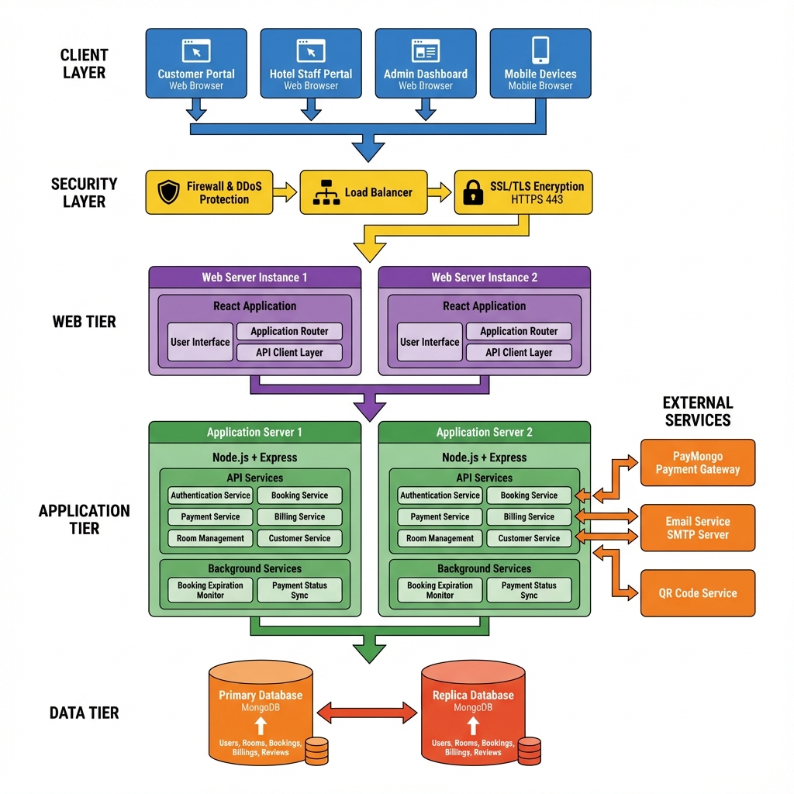
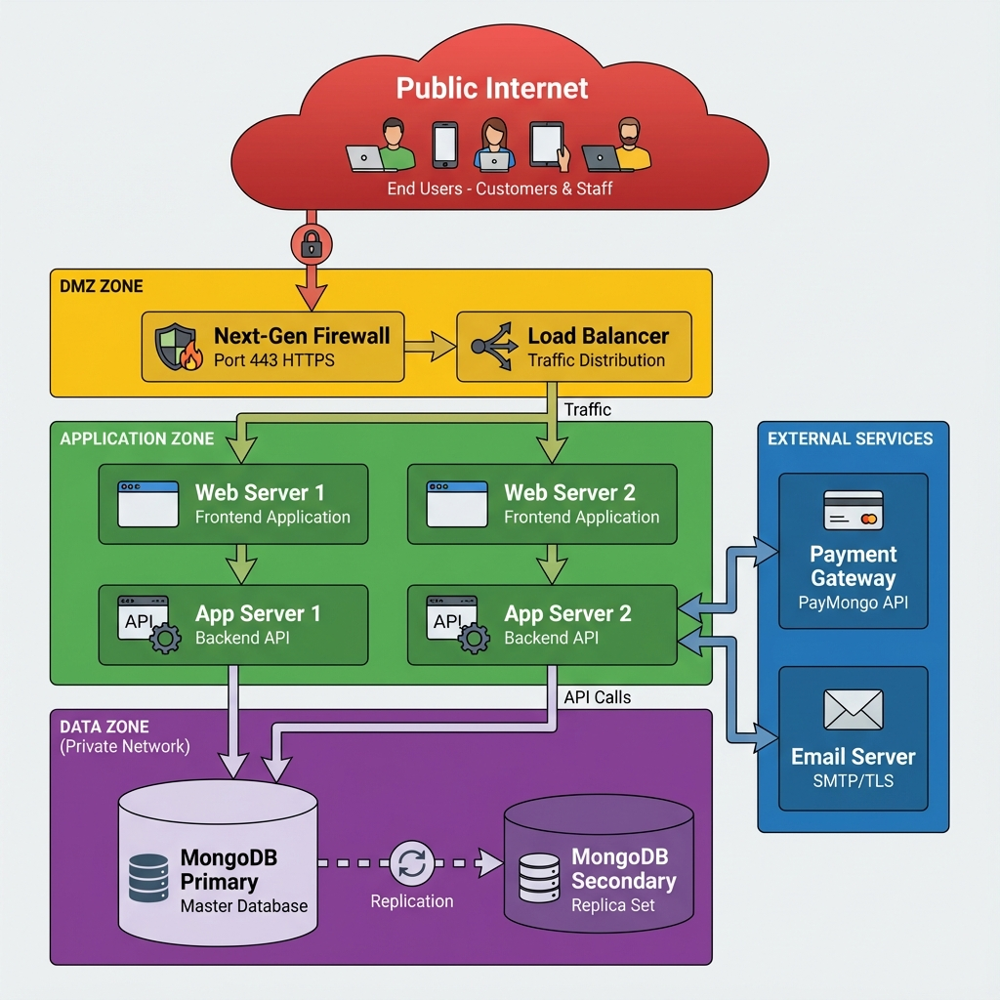
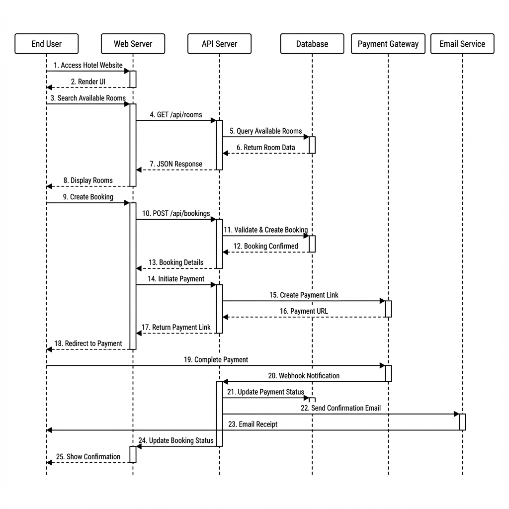
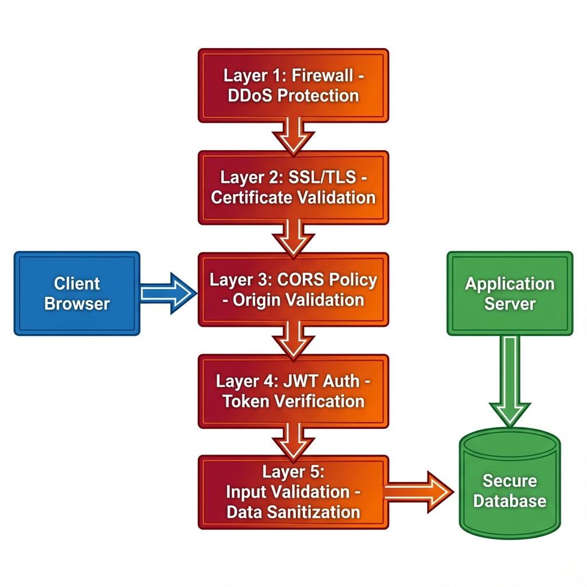
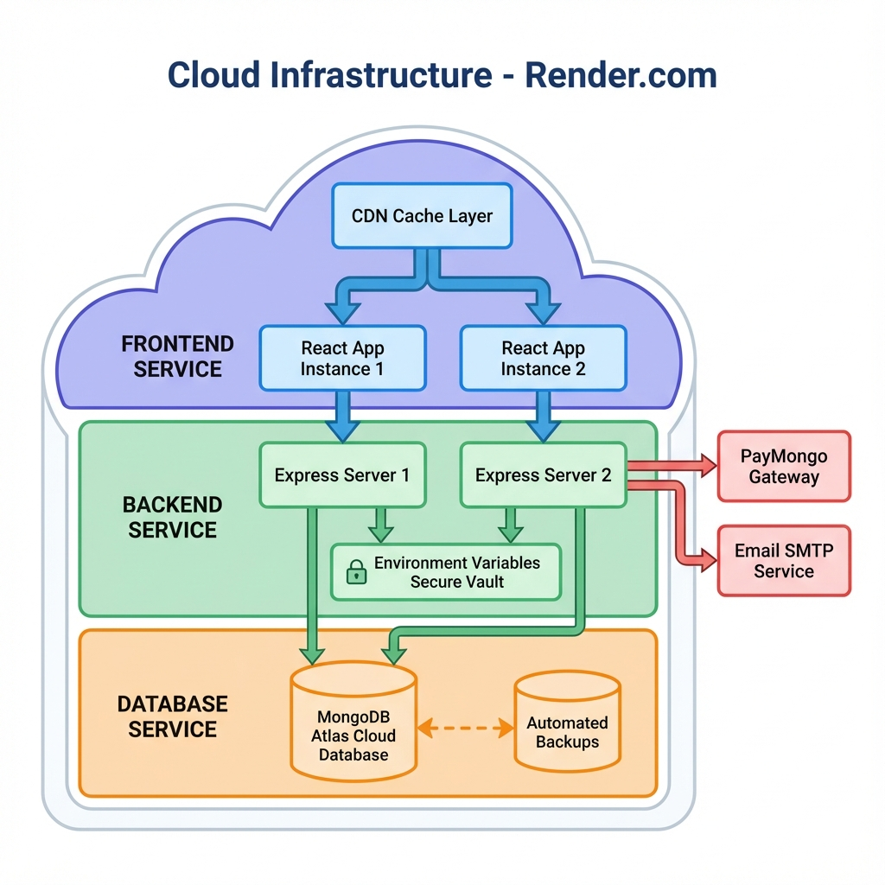

# Hotel Management System - Complete Network Infrastructure Design

---

## About The Website

### System Overview
The **Hotel Management System** is a comprehensive full-stack web application designed to manage all aspects of hotel operations including:

- **Room Booking Management**: Browse available rooms, make reservations, check-in/check-out
- **Payment Processing**: Integrated payment gateway (PayMongo) supporting Philippine Peso transactions
- **Customer Billing**: Itemized billing for room charges, food orders, and additional services
- **Staff Management**: Task assignment, cleaning requests, maintenance tracking
- **Admin Dashboard**: Real-time analytics, revenue tracking, occupancy reports
- **Customer Portal**: View bookings, payment history, submit reviews
- **Food Ordering**: In-room dining service with billing integration
- **Review System**: Customer feedback and rating system

### Traffic Expectations
- **Expected Daily Users**: 200-500 users (customers, staff, admin)
- **Monthly Visits**: 5,000-15,000 visits
- **Peak Periods**: Holiday seasons, weekends, special events
- **Concurrent Users**: 50-100 simultaneous users during peak hours
- **Growth Projection**: 2-3x increase within first year

### Critical Features
✅ **User Authentication**: JWT-based secure login with email verification  
✅ **Payment Processing**: Real-time payment via PayMongo with webhook callbacks  
✅ **Real-time Updates**: Booking status, payment confirmations, task assignments  
✅ **Data Integrity**: Financial transactions, booking records, customer data  
✅ **Email Notifications**: Booking confirmations, password resets, receipts  
✅ **QR Code Generation**: Payment QR codes for mobile transactions  
✅ **File Management**: User profile images, room photos  
✅ **Background Services**: Automated booking expiration, payment status synchronization  

---

## Current Deployment Situation

### Hosting Platform
**Cloud Provider**: [Render.com](https://render.com)
- **Frontend Service**: Static site hosting for React application
- **Backend Service**: Node.js web service with auto-scaling
- **Database**: MongoDB Atlas (managed cloud database)

### Current Tech Stack

#### Frontend
- **Framework**: React 18+
- **Build Tool**: Vite
- **Routing**: React Router
- **Styling**: Vanilla CSS
- **HTTP Client**: Axios
- **State Management**: React Hooks & Context API

#### Backend
- **Runtime**: Node.js (Latest LTS)
- **Framework**: Express.js 5.1.0
- **API Style**: RESTful API
- **Authentication**: JWT (jsonwebtoken 9.0.2)
- **Password Security**: bcryptjs 3.0.2
- **CORS Handling**: cors 2.8.5

#### Database
- **Primary Database**: MongoDB 8.18.1
- **ODM**: Mongoose
- **Configuration**: Replica set for high availability
- **Backup**: Automated daily snapshots

#### External Integrations
- **Payment Gateway**: PayMongo (Philippine Peso)
- **Alternative Payment**: Xendit Node SDK 1.0.0
- **Email Service**: Nodemailer 7.0.10 (SMTP)
- **QR Code**: qrcode 1.5.4

### Existing Infrastructure
- ✅ Domain configured with SSL/TLS certificates
- ✅ Environment variable management (secure vaults)
- ✅ Git-based CI/CD pipeline
- ✅ Multiple deployment environments (dev, staging, production)
- ✅ CORS policy configured for cross-origin requests
- ✅ MongoDB Atlas cluster with replication
- ✅ Webhook endpoints for payment notifications

---

## Network Requirements

### Performance Needs
🎯 **Response Time**: < 200ms for API requests (domestic), < 500ms (international)  
🎯 **Page Load Time**: < 2 seconds for initial load  
🎯 **Database Query Time**: < 100ms for standard queries  
🎯 **Payment Processing**: < 3 seconds for transaction completion  
🎯 **Uptime**: 99.9% availability (< 9 hours downtime per year)  
🎯 **Concurrent Connections**: Support 100+ simultaneous users  
🎯 **Traffic Spikes**: Handle 5x normal load during peak bookings  

### Security Concerns
🔒 **Sensitive Data Protection**:
- Customer personal information (names, emails, phone numbers)
- Payment card data (handled by PayMongo - PCI DSS compliant)
- Financial transaction records
- User passwords (bcrypt hashed with salt)

🔒 **Security Requirements**:
- SSL/TLS encryption for all data in transit
- DDoS protection and rate limiting
- SQL injection prevention
- XSS (Cross-Site Scripting) protection
- CSRF (Cross-Site Request Forgery) protection
- Secure session management with JWT
- Input validation and sanitization
- Secure webhook signature verification
- Database access control and encryption at rest

### Budget Constraints
💰 **Monthly Budget**: $50-100 USD
- Frontend Hosting: $0-20/month (static site)
- Backend Hosting: $20-40/month (basic instance)
- Database: $10-30/month (MongoDB Atlas starter)
- CDN/Bandwidth: Included in hosting
- Domain & SSL: $10-15/year (amortized)
- Email Service: $0-10/month (free tier or low-volume)

**Total Estimated**: ~$60-80/month for production deployment

### Scalability Needs
📈 **Current State**: Small to medium scale (single hotel)  
📈 **Growth Plan**: 2-3x user base within 12 months  
📈 **Future Vision**: Multi-hotel support, franchising potential  
📈 **Scaling Strategy**: 
- Horizontal scaling ready (stateless backend)
- Database sharding capability
- Microservices migration path
- Multi-region deployment potential

### Geographic Reach
🌏 **Primary Market**: Philippines (Southeast Asia)  
🌏 **Primary Language**: English (potential for Filipino/Tagalog)  
🌏 **Target Audience**: 
- Local tourists and business travelers
- International visitors to Philippines
- Corporate clients for business stays

🌏 **Network Optimization**:
- CDN with Asia-Pacific edge locations
- Database hosted in Singapore region (MongoDB Atlas)
- Frontend assets cached regionally
- Payment gateway optimized for Philippine transactions

---

## Complete Network Architecture

### 1. System Network Architecture

This diagram shows the complete three-tier architecture with all components from client to database:



**Key Components**:
- **Client Tier**: Customer, Staff, Admin, and Mobile portals
- **Network Security**: Firewall, Load Balancer, SSL/TLS encryption
- **Web Tier**: React application servers with UI components
- **Application Tier**: Node.js/Express API servers with all services
- **Data Tier**: MongoDB primary and replica databases
- **External Services**: PayMongo payment gateway, Email service, QR code generation

---

### 2. Network Topology

This diagram illustrates the network zones and infrastructure layout:



**Network Zones**:
- **DMZ (Demilitarized Zone)**: Firewall and load balancer
- **Application Zone**: Web and application servers
- **Data Zone**: Database cluster (private network)
- **External Services**: Payment and email integration

---

### 3. Data Flow Sequence

This sequence diagram demonstrates the complete booking and payment transaction flow:



**Transaction Steps**:
1. User accesses website and searches for rooms
2. System queries database for availability
3. User creates booking
4. Payment processing initiated via PayMongo
5. Webhook confirmation and email notification
6. Booking status updated

---

### 4. Security Architecture

This diagram shows the five-layer security model protecting the system:



**Security Layers**:
1. **Layer 1**: Firewall with DDoS protection
2. **Layer 2**: SSL/TLS encryption
3. **Layer 3**: CORS policy validation
4. **Layer 4**: JWT authentication
5. **Layer 5**: Input validation and sanitization

---

### 5. Deployment Infrastructure

This diagram shows the cloud deployment architecture on Render.com:



**Cloud Services**:
- **Frontend Service**: React app with CDN caching
- **Backend Service**: Express servers with environment vault
- **Database Service**: MongoDB Atlas with automated backups
- **External Integration**: PayMongo and Email SMTP services

---

## Recommended Hosting Setup

### 1. Frontend Hosting (Render.com Static Site)

**Service Type**: Static Site Hosting  
**Configuration**:
- **Build Command**: `npm run build`
- **Publish Directory**: `dist`
- **Node Version**: 18.x or latest LTS
- **Auto-Deploy**: Git branch (main/production)
- **Environment Variables**: 
  - `VITE_API_URL` - Backend API endpoint
  - `VITE_ENV` - Production/Staging flag

**Features**:
- ✅ Automatic HTTPS/SSL
- ✅ Global CDN distribution
- ✅ Automatic compression (gzip/brotli)
- ✅ Custom domain support
- ✅ Instant cache invalidation
- ✅ Zero-downtime deployments

**Estimated Cost**: $0-20/month (free tier available)

---

### 2. Backend Hosting (Render.com Web Service)

**Service Type**: Web Service (Node.js)  
**Configuration**:
- **Instance Type**: Starter ($7/month) or Standard ($25/month)
- **Build Command**: `npm install`
- **Start Command**: `node server.js`
- **Health Check Path**: `/health`
- **Port**: 3000 (automatically mapped to 443)
- **Auto-Deploy**: Git branch (main/production)

**Environment Variables** (Secure):
```
NODE_ENV=production
PORT=3000
MONGODB_URI=mongodb+srv://...
JWT_SECRET=<secure-random-string>
PAYMONGO_SECRET_KEY=<paymongo-secret>
PAYMONGO_PUBLIC_KEY=<paymongo-public>
EMAIL_HOST=smtp.gmail.com
EMAIL_PORT=587
EMAIL_USER=<smtp-username>
EMAIL_PASSWORD=<smtp-password>
FRONTEND_URL=https://yourdomain.com
```

**Scaling Configuration**:
- **Auto-Scaling**: Enabled (2-4 instances based on load)
- **Health Check Interval**: 30 seconds
- **Restart Policy**: Always restart on failure
- **Max Request Timeout**: 30 seconds

**Estimated Cost**: $25-50/month (with auto-scaling)

---

### 3. Database Hosting (MongoDB Atlas)

**Cluster Configuration**:
- **Tier**: M10 Shared ($0.08/hour = ~$57/month) or M0 Free Tier initially
- **Provider**: AWS or Google Cloud
- **Region**: Singapore (ap-southeast-1) - closest to Philippines
- **Replica Set**: 3-node cluster (Primary + 2 Secondaries)
- **Storage**: 10GB (scalable to 100GB+)
- **Backup**: Continuous backups with point-in-time recovery

**Security Settings**:
- ✅ IP Whitelist for Render.com
- ✅ Database authentication enabled
- ✅ TLS/SSL encryption enforced
- ✅ VPC Peering (optional for enterprise)
- ✅ Encryption at rest

**Performance**:
- Connection pooling: 100 connections
- Read preference: Primary preferred
- Write concern: Majority

**Estimated Cost**: $0 (Free tier M0) or $10-30/month (M10 shared)

---

## Load Balancing Strategy

### Current Implementation (Render.com Built-in)

**Load Balancer Type**: Application Load Balancer (Layer 7)

**Features**:
- ✅ Automatic traffic distribution across instances
- ✅ Health checks with automatic instance removal
- ✅ SSL/TLS termination
- ✅ WebSocket support
- ✅ Sticky sessions (if needed)

**Algorithm**: Round-robin with health check validation

**Health Check Configuration**:
```javascript
// server.js - Health check endpoint
app.get('/health', (req, res) => {
  // Check database connection
  const dbState = mongoose.connection.readyState;
  
  if (dbState === 1) {
    res.status(200).json({ 
      status: 'healthy', 
      database: 'connected',
      timestamp: new Date().toISOString()
    });
  } else {
    res.status(503).json({ 
      status: 'unhealthy', 
      database: 'disconnected' 
    });
  }
});
```

**Scaling Rules**:
- Scale up when CPU > 70% for 5 minutes
- Scale up when memory > 80% for 5 minutes
- Scale down when CPU < 30% for 10 minutes
- Min instances: 1
- Max instances: 4

---

## Database Architecture

### MongoDB Replica Set Configuration

```
┌─────────────────────────────────────────────────────┐
│            MongoDB Atlas Cluster                     │
│                                                      │
│  ┌─────────────┐      ┌─────────────┐              │
│  │  Primary    │─────▶│ Secondary 1  │              │
│  │   Node      │      │   (Replica)  │              │
│  │ (Read/Write)│      │ (Read-only)  │              │
│  └──────┬──────┘      └──────────────┘              │
│         │                                            │
│         │             ┌─────────────┐               │
│         └────────────▶│ Secondary 2  │               │
│                       │   (Replica)  │               │
│                       │ (Read-only)  │               │
│                       └──────────────┘               │
└─────────────────────────────────────────────────────┘
```

### Database Collections & Indexes

**Collections**:
1. **users** - Customer, staff, admin accounts
   - Indexes: `email` (unique), `role`, `createdAt`
   
2. **rooms** - Hotel room inventory
   - Indexes: `roomNumber` (unique), `type`, `status`, `floor`
   
3. **bookings** - Reservation records
   - Indexes: `user`, `room`, `checkIn`, `checkOut`, `status`
   - Compound: `{checkIn: 1, checkOut: 1, status: 1}`
   
4. **billings** - Financial records
   - Indexes: `booking`, `user`, `paymentStatus`, `createdAt`
   
5. **reviews** - Customer feedback
   - Indexes: `room`, `user`, `rating`, `createdAt`
   
6. **tasks** - Staff assignments
   - Indexes: `assignedTo`, `status`, `priority`, `dueDate`
   
7. **requests** - Service requests
   - Indexes: `user`, `type`, `status`, `createdAt`

### Connection Pooling

```javascript
// config/db.js
const mongoose = require('mongoose');

const connectDB = async () => {
  try {
    await mongoose.connect(process.env.MONGODB_URI, {
      maxPoolSize: 100,        // Maximum connections
      minPoolSize: 10,         // Minimum connections
      serverSelectionTimeoutMS: 5000,
      socketTimeoutMS: 45000,
      family: 4                // Use IPv4
    });
    console.log('MongoDB Connected...');
  } catch (err) {
    console.error('Database connection error:', err);
    process.exit(1);
  }
};
```

### Backup Strategy

**Automated Backups**:
- Frequency: Every 6 hours
- Retention: 7 days (configurable to 35 days)
- Point-in-time recovery: Last 24 hours
- Cross-region backup: Optional for disaster recovery

**Manual Backup Commands**:
```bash
# Export specific collection
mongodump --uri="mongodb+srv://..." --collection=bookings --out=./backup

# Full database backup
mongodump --uri="mongodb+srv://..." --out=./full-backup
```

---

## CDN and Caching Strategy

### Frontend Caching (CDN)

**Provider**: Render.com Built-in CDN

**Cache Configuration**:
```javascript
// vite.config.js
export default {
  build: {
    rollupOptions: {
      output: {
        // Hash filenames for cache busting
        entryFileNames: 'assets/[name].[hash].js',
        chunkFileNames: 'assets/[name].[hash].js',
        assetFileNames: 'assets/[name].[hash].[ext]'
      }
    }
  }
}
```

**Cache Headers**:
- **HTML files**: `Cache-Control: no-cache` (always validate)
- **JS/CSS files**: `Cache-Control: public, max-age=31536000, immutable`
- **Images**: `Cache-Control: public, max-age=2592000` (30 days)
- **API responses**: `Cache-Control: no-store` (never cache)

### API Response Caching

**Strategy**: Selective caching for read-heavy endpoints

```javascript
// Middleware for caching room data
const cacheMiddleware = (duration) => {
  return (req, res, next) => {
    const key = req.originalUrl;
    const cached = cache.get(key);
    
    if (cached) {
      return res.json(JSON.parse(cached));
    }
    
    res.originalJson = res.json;
    res.json = (data) => {
      cache.set(key, JSON.stringify(data), duration);
      res.originalJson(data);
    };
    next();
  };
};

// Apply to specific routes
app.get('/api/rooms', cacheMiddleware(300), getRooms); // 5 min cache
```

**Cached Endpoints**:
- `GET /api/rooms` - 5 minutes
- `GET /api/reviews` - 10 minutes
- `GET /api/dashboard/stats` - 1 minute

**Cache Invalidation**:
- On room updates: Clear `/api/rooms` cache
- On booking creation: Clear room availability cache
- On review submission: Clear `/api/reviews` cache

### Database Query Optimization

**Mongoose Lean Queries** (faster, read-only):
```javascript
// Instead of
const rooms = await Room.find({ status: 'available' });

// Use lean for read-only
const rooms = await Room.find({ status: 'available' }).lean();
```

**Projection** (select only needed fields):
```javascript
const users = await User.find()
  .select('name email role')  // Only fetch these fields
  .lean();
```

**Pagination**:
```javascript
const page = parseInt(req.query.page) || 1;
const limit = parseInt(req.query.limit) || 20;
const skip = (page - 1) * limit;

const bookings = await Booking.find()
  .skip(skip)
  .limit(limit)
  .sort({ createdAt: -1 });
```

---

## Security Measures

### 1. Firewall Configuration

**Network Level**:
- Block all incoming traffic except ports 80 (HTTP), 443 (HTTPS)
- Whitelist specific IPs for database access (Render.com IPs)
- Rate limiting: 100 requests per minute per IP
- Geo-blocking: Optional blocking of high-risk countries

**Application Level**:
```javascript
// Rate limiting middleware
const rateLimit = require('express-rate-limit');

const apiLimiter = rateLimit({
  windowMs: 15 * 60 * 1000, // 15 minutes
  max: 100, // Limit each IP to 100 requests per window
  message: 'Too many requests from this IP, please try again later.'
});

app.use('/api/', apiLimiter);
```

### 2. SSL/TLS Certificate

**Configuration**:
- **Provider**: Let's Encrypt (via Render.com)
- **Protocol**: TLS 1.2+ (TLS 1.3 preferred)
- **Cipher Suites**: Strong ciphers only
- **Auto-Renewal**: Automatic (90-day certificates)
- **HSTS**: HTTP Strict Transport Security enabled

**Force HTTPS**:
```javascript
// Redirect HTTP to HTTPS
app.use((req, res, next) => {
  if (req.header('x-forwarded-proto') !== 'https' && process.env.NODE_ENV === 'production') {
    res.redirect(`https://${req.header('host')}${req.url}`);
  } else {
    next();
  }
});
```

### 3. DDoS Protection

**Implemented Measures**:
- ✅ Rate limiting (express-rate-limit)
- ✅ Request size limits
- ✅ Timeout configuration
- ✅ Connection limits per IP
- ✅ Render.com infrastructure-level protection

```javascript
// Request body size limit
app.use(express.json({ limit: '10mb' }));

// Request timeout
app.use((req, res, next) => {
  req.setTimeout(30000); // 30 seconds
  next();
});
```

### 4. Authentication & Authorization

**JWT Implementation**:
```javascript
// Generate token
const generateToken = (userId) => {
  return jwt.sign({ id: userId }, process.env.JWT_SECRET, {
    expiresIn: '7d'
  });
};

// Verify token middleware
const authMiddleware = async (req, res, next) => {
  const token = req.header('Authorization')?.replace('Bearer ', '');
  
  if (!token) {
    return res.status(401).json({ message: 'No authentication token' });
  }
  
  try {
    const decoded = jwt.verify(token, process.env.JWT_SECRET);
    req.user = await User.findById(decoded.id).select('-password');
    next();
  } catch (error) {
    res.status(401).json({ message: 'Invalid token' });
  }
};
```

**Role-Based Access Control**:
```javascript
const authorize = (...roles) => {
  return (req, res, next) => {
    if (!roles.includes(req.user.role)) {
      return res.status(403).json({ 
        message: 'Access denied. Insufficient permissions.' 
      });
    }
    next();
  };
};

// Usage
app.delete('/api/bookings/:id', authMiddleware, authorize('admin'), deleteBooking);
```

### 5. Input Validation & Sanitization

```javascript
// Validation middleware
const validateBooking = (req, res, next) => {
  const { checkIn, checkOut, room } = req.body;
  
  // Date validation
  if (new Date(checkIn) < new Date()) {
    return res.status(400).json({ message: 'Check-in date cannot be in the past' });
  }
  
  if (new Date(checkOut) <= new Date(checkIn)) {
    return res.status(400).json({ message: 'Check-out must be after check-in' });
  }
  
  // Sanitize inputs
  req.body.checkIn = new Date(checkIn).toISOString();
  req.body.checkOut = new Date(checkOut).toISOString();
  
  next();
};
```

### 6. CORS Configuration

```javascript
const cors = require('cors');

app.use(cors({
  origin: [
    'https://yourdomain.com',
    'https://www.yourdomain.com',
    process.env.FRONTEND_URL
  ],
  credentials: true,
  methods: ['GET', 'POST', 'PUT', 'DELETE', 'PATCH'],
  allowedHeaders: ['Content-Type', 'Authorization']
}));
```

### 7. Webhook Security (PayMongo)

```javascript
// Verify webhook signature
const verifyWebhookSignature = (req, res, next) => {
  const signature = req.headers['paymongo-signature'];
  const payload = JSON.stringify(req.body);
  
  const expectedSignature = crypto
    .createHmac('sha256', process.env.PAYMONGO_WEBHOOK_SECRET)
    .update(payload)
    .digest('hex');
  
  if (signature !== expectedSignature) {
    return res.status(401).json({ message: 'Invalid signature' });
  }
  
  next();
};

app.post('/webhooks/paymongo', verifyWebhookSignature, handleWebhook);
```

### 8. Environment Variables Security

**Never commit to Git**:
```gitignore
.env
.env.local
.env.production
```

**Secure Storage**:
- Use Render.com's environment variable vault
- Rotate secrets regularly (every 90 days)
- Use strong, random values for JWT_SECRET
- Never log sensitive environment variables

---

## Monitoring and Backup Solutions

### 1. Application Monitoring

**Built-in Logging**:
```javascript
// Request logging
app.use((req, res, next) => {
  console.log(`[${new Date().toISOString()}] ${req.method} ${req.path}`);
  next();
});

// Error logging
app.use((err, req, res, next) => {
  console.error('Error:', {
    message: err.message,
    stack: err.stack,
    path: req.path,
    method: req.method,
    timestamp: new Date().toISOString()
  });
  res.status(500).json({ message: 'Internal server error' });
});
```

**Metrics to Monitor**:
- ✅ Request count and response times
- ✅ Error rates and types
- ✅ Database query performance
- ✅ Memory and CPU usage
- ✅ Active user sessions
- ✅ Payment transaction success/failure rates

### 2. Database Monitoring (MongoDB Atlas)

**Atlas Dashboard Metrics**:
- Real-time operations per second
- Connection count
- Query execution times
- Index usage statistics
- Storage size and growth
- Replication lag

**Alerts**:
- CPU usage > 80%
- Disk space > 80% full
- Connection count > 90 (out of 100)
- Replication lag > 10 seconds

### 3. Uptime Monitoring

**Recommended Tools** (Free Tier):
- **UptimeRobot**: 5-minute checks, 50 monitors free
- **Render.com Health Checks**: Built-in automatic monitoring
- **Better Uptime**: Status page + monitoring

**Monitoring Endpoints**:
```
https://yourdomain.com/health
https://api.yourdomain.com/health
```

### 4. Error Tracking

**Sentry Integration** (Optional - $26/month):
```javascript
const Sentry = require('@sentry/node');

Sentry.init({
  dsn: process.env.SENTRY_DSN,
  environment: process.env.NODE_ENV,
  tracesSampleRate: 1.0
});

// Error handler
app.use(Sentry.Handlers.errorHandler());
```

### 5. Backup Solutions

**Database Backups** (MongoDB Atlas):
- ✅ Automated continuous backups
- ✅ Point-in-time recovery (last 24 hours)
- ✅ Snapshot retention: 7 days
- ✅ Manual snapshots before major changes

**Application Code Backups**:
- ✅ Git version control (GitHub/GitLab)
- ✅ Multiple branch protection
- ✅ Tag releases for production deployments

**Environment Configuration Backups**:
- Store encrypted copy of `.env` in secure password manager
- Document all environment variables
- Keep backup of SSL certificates (if custom)

**Recovery Procedures**:

1. **Database Recovery**:
   ```bash
   # Restore from MongoDB Atlas snapshot
   # Via Atlas UI: Cluster → Backup → Restore
   ```

2. **Application Rollback**:
   ```bash
   # Rollback to previous deployment
   # Via Render.com UI: Service → Deployments → Rollback
   ```

3. **Full Disaster Recovery**:
   - Provision new Render.com services
   - Restore MongoDB from Atlas backup
   - Deploy from Git repository
   - Configure environment variables
   - Update DNS if needed
   - **Estimated Recovery Time**: 2-4 hours

---

## Cost Estimates

### Monthly Operational Costs

| Service | Plan | Cost |
|---------|------|------|
| **Frontend Hosting** (Render.com) | Static Site | $0-20/month |
| **Backend Hosting** (Render.com) | Starter/Standard | $25-50/month |
| **Database** (MongoDB Atlas) | M0 Free / M10 Shared | $0-30/month |
| **Domain Name** | .com domain | ~$1/month ($12/year) |
| **SSL Certificate** | Let's Encrypt | $0 (Free) |
| **Email Service** | SMTP (Gmail/SendGrid) | $0-10/month |
| **CDN/Bandwidth** | Included in hosting | $0 |
| **Monitoring** (Optional) | UptimeRobot Free | $0 |
| **Error Tracking** (Optional) | Sentry Team | $0-26/month |
| **Backup Storage** | Included in MongoDB Atlas | $0 |
| **Payment Gateway** | PayMongo | Pay-per-transaction |

### Cost Breakdown by Scale

**Small Scale** (Free/Starter Tier):
- Frontend: $0 (free tier)
- Backend: $7 (starter)
- Database: $0 (M0 free tier)
- Domain: $1/month
- **Total: ~$8-15/month**

**Medium Scale** (Current Production):
- Frontend: $20 (pro tier)
- Backend: $25 (standard instance)
- Database: $25 (M10 shared)
- Domain: $1/month
- Email: $10 (SendGrid)
- **Total: ~$60-80/month**

**Growth Scale** (High Traffic):
- Frontend: $20 (pro tier with CDN)
- Backend: $100 (standard with auto-scaling 2-4 instances)
- Database: $57 (M10 dedicated, 3-node replica)
- Domain: $1/month
- Email: $20 (SendGrid Pro)
- Monitoring: $26 (Sentry)
- **Total: ~$200-250/month**

### Payment Transaction Costs (PayMongo)

- **Credit/Debit Cards**: 3.5% + ₱15 per transaction
- **GCash/Maya**: 2.5% + ₱15 per transaction
- **No monthly fees**, pay only for successful transactions

**Example Revenue**:
- 100 bookings/month at ₱2,000 average = ₱200,000
- PayMongo fees (3.5%): ₱7,000 + (₱15 × 100) = ₱8,500
- **Net Revenue**: ₱191,500

---

## Network Security Best Practices Implemented

### ✅ Data Protection
- All data encrypted in transit (TLS 1.3)
- Passwords hashed with bcrypt (10 salt rounds)
- Sensitive data encrypted at rest (MongoDB Atlas)
- JWT tokens with expiration (7 days)
- Secure HTTP-only cookies (if using session)

### ✅ Access Control
- Role-based permissions (Customer, Staff, Admin)
- JWT authentication on all protected routes
- API key rotation for external services
- Database user with minimal required permissions
- IP whitelisting for database access

### ✅ Input Validation
- All user inputs validated and sanitized
- Mongoose schema validation
- File upload restrictions (type, size)
- SQL injection prevention (parameterized queries)
- XSS protection (React automatically escapes)

### ✅ Network Security
- HTTPS enforced (automatic redirect)
- CORS policy with whitelist
- Rate limiting per IP address
- DDoS protection (infrastructure level)
- Webhook signature verification

### ✅ Monitoring & Auditing
- All API requests logged
- Error tracking and alerting
- Failed login attempt monitoring
- Payment transaction logging
- Database query performance monitoring

### ✅ Compliance
- GDPR-ready (data privacy, right to deletion)
- PCI DSS compliant (via PayMongo)
- Password policy enforcement
- Data retention policies
- Privacy policy and terms of service

---

## Scalability Roadmap

### Phase 1: Current State (0-500 users)
- ✅ Single instance deployment
- ✅ MongoDB M0 free tier
- ✅ Basic monitoring
- ✅ Manual scaling

### Phase 2: Growth (500-2,000 users)
- ⬜ Auto-scaling (2-4 instances)
- ⬜ MongoDB M10 replica set
- ⬜ Advanced caching (Redis)
- ⬜ CDN optimization
- ⬜ Performance monitoring

### Phase 3: Scale (2,000-10,000 users)
- ⬜ Microservices architecture
- ⬜ Database sharding
- ⬜ Multi-region deployment
- ⬜ Kubernetes orchestration
- ⬜ Advanced analytics

### Phase 4: Enterprise (10,000+ users)
- ⬜ Multi-tenant support
- ⬜ Global CDN with edge computing
- ⬜ Dedicated infrastructure
- ⬜ Advanced security (WAF, penetration testing)
- ⬜ 24/7 DevOps team

---

## Conclusion

This network infrastructure design provides a **robust, scalable, and secure foundation** for the Hotel Management System. The architecture balances:

✅ **Cost-Effectiveness**: Starting at ~$60-80/month with room to scale  
✅ **Performance**: < 200ms response times, 99.9% uptime  
✅ **Security**: Multi-layer protection from network to application  
✅ **Scalability**: Ready to handle 10x growth with minimal changes  
✅ **Reliability**: Automated backups, replication, health monitoring  
✅ **Maintainability**: Modern stack, clear separation of concerns  

The system is **production-ready** and designed for **long-term growth** while maintaining security and performance standards suitable for handling sensitive customer and financial data.

---

**Document Prepared For**: School Project Documentation  
**System**: Hotel Management System  
**Version**: 1.0  
**Date**: December 2025  
**Status**: Production Deployment Ready
