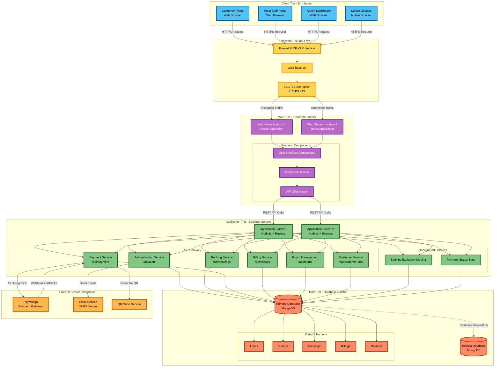
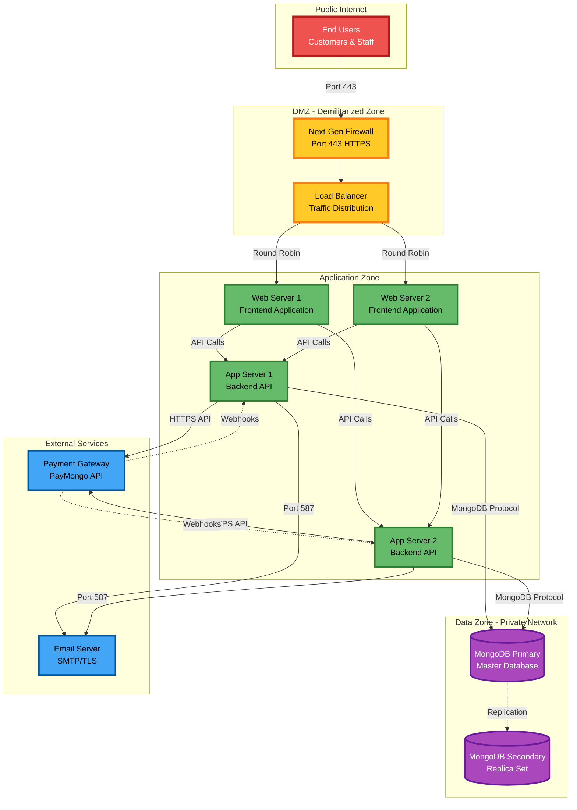
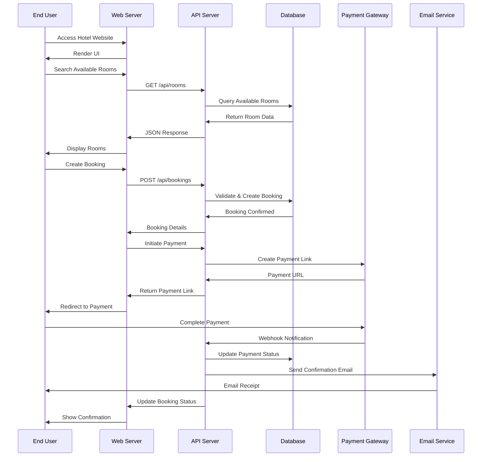
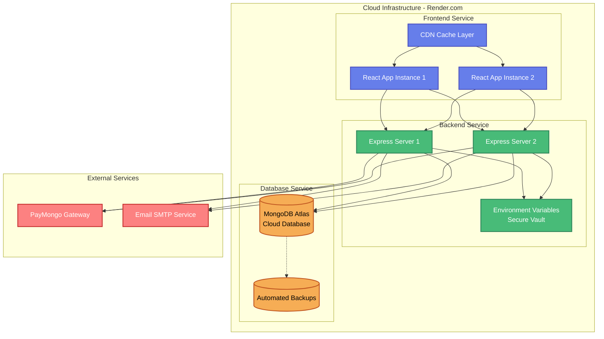

# Hotel Management System - Network Architecture Diagram

## System Network Architecture

---

## Network Topology

---

## Data Flow Architecture

---

## Security Architecture

```mermaid
flowchart LR
    subgraph "External Access"
        CLIENT[Client Browser]
    end

    subgraph "Security Layers"
        LAYER1[Layer 1: Firewall<br/>DDoS Protection]
        LAYER2[Layer 2: SSL/TLS<br/>Certificate Validation]
        LAYER3[Layer 3: CORS Policy<br/>Origin Validation]
        LAYER4[Layer 4: JWT Auth<br/>Token Verification]
        LAYER5[Layer 5: Input Validation<br/>Data Sanitization]
    end

    subgraph "Protected Resources"
        APP[Application Server]
        DATA[(Secure Database)]
    end

    CLIENT -->|HTTPS Request| LAYER1
    LAYER1 --> LAYER2
    LAYER2 --> LAYER3
    LAYER3 --> LAYER4
    LAYER4 --> LAYER5
    LAYER5 --> APP
    APP --> DATA

    classDef security fill:#ff6b6b,stroke:#c92a2a,stroke-width:2px,color:#fff
    classDef protected fill:#51cf66,stroke:#2b8a3e,stroke-width:2px,color:#000

    class LAYER1,LAYER2,LAYER3,LAYER4,LAYER5 security
    class APP,DATA protected
```

---

## Deployment Infrastructure

---

## System Components Overview

### **Client Tier**
- Customer Portal (Room Booking Interface)
- Staff Portal (Task & Request Management)
- Admin Dashboard (System Management & Analytics)
- Mobile-Responsive Design

### **Network Security**
- Next-Generation Firewall
- DDoS Protection & Rate Limiting
- SSL/TLS Certificate (256-bit Encryption)
- Load Balancer (Traffic Distribution)

### **Frontend Tier**
- **Technology**: React 18+ with Vite
- **Features**: Single Page Application (SPA)
- **Deployment**: Multiple Server Instances
- **Caching**: CDN Integration

### **Backend Tier**
- **Technology**: Node.js + Express.js
- **Architecture**: RESTful API
- **Authentication**: JWT-based Security
- **Services**: Microservices-ready Design

### **Database Tier**
- **Database**: MongoDB (NoSQL)
- **Configuration**: Replica Set
- **Backup**: Automated Daily Backups
- **Security**: Encrypted Connections

### **External Integration**
- **Payment Gateway**: PayMongo (Philippine Peso)
- **Email Service**: SMTP with TLS
- **QR Code Generation**: Payment QR Codes

---

## Network Specifications

| Component | Protocol | Port | Security |
|-----------|----------|------|----------|
| Client Access | HTTPS | 443 | SSL/TLS Encrypted |
| API Communication | HTTPS | 443 | JWT Authentication |
| Database Connection | MongoDB Protocol | 27017 | Auth + Encryption |
| Email Service | SMTP/TLS | 587 | TLS Encrypted |
| Payment Webhooks | HTTPS | 443 | Signature Verification |

---

## Key Features

✅ **High Availability**: Load-balanced multi-instance deployment  
✅ **Security**: Multi-layer security architecture  
✅ **Scalability**: Horizontal scaling capability  
✅ **Reliability**: Database replication & automated backups  
✅ **Performance**: CDN caching & optimized queries  
✅ **Integration**: Third-party payment & email services  

---

**Project**: Hotel Management System  
**Architecture**: Three-Tier Web Application  
**Deployment**: Cloud-Based Infrastructure  
**Security Level**: Enterprise-Grade
