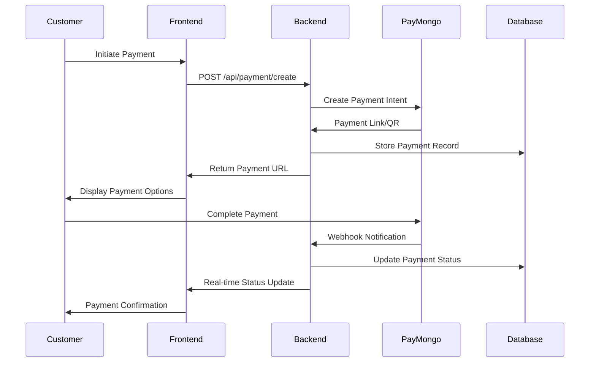
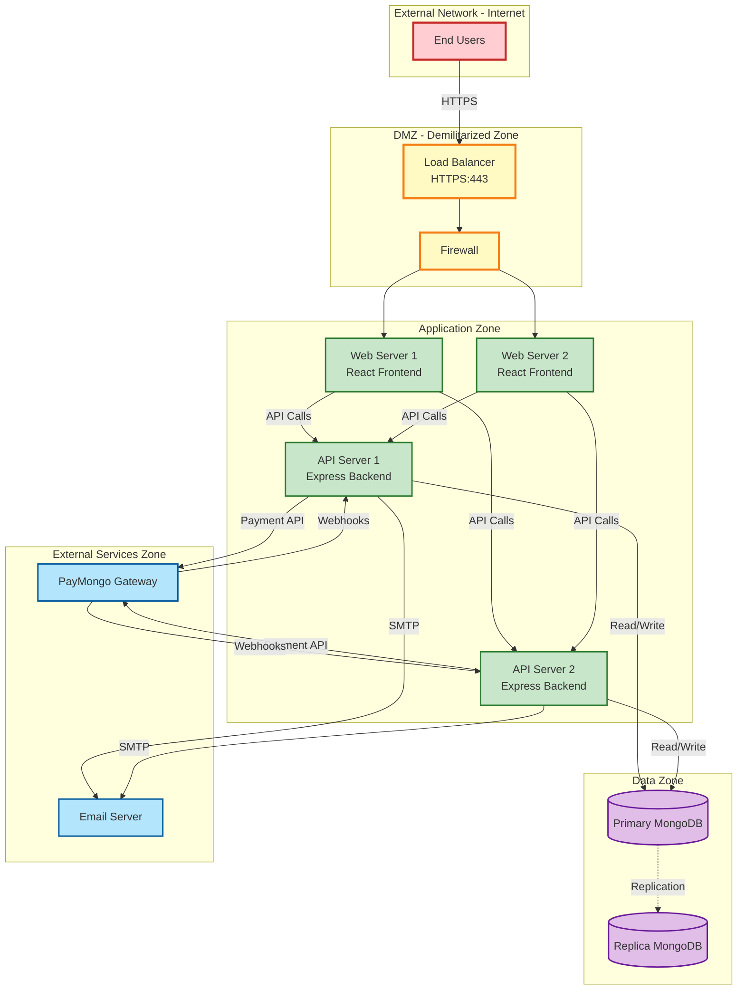

# Hotel Management System - Network Design Documentation

## System Overview

The Hotel Management System is a full-stack web application designed to manage hotel operations including room bookings, customer billing, food orders, cleaning requests, and payment processing. The system follows a modern three-tier architecture with clear separation between the presentation layer, application layer, and data layer.

---

## Network Architecture Diagram

```mermaid
flowchart TB
    subgraph "Client Layer - User Devices"
        CL1[Web Browser - Customer]
        CL2[Web Browser - Staff]
        CL3[Web Browser - Admin]
        CL4[Mobile Browser]
    end

    subgraph "Network Layer"
        FW[Firewall/Load Balancer]
        SSL[SSL/TLS Certificate]
    end

    subgraph "Presentation Layer - Frontend Server"
        VITE[Vite Development Server<br/>Port: 5173-5176]
        subgraph "React Application"
            UI[React UI Components]
            ROUTER[React Router]
            STATE[State Management]
        end
    end

    subgraph "Application Layer - Backend Server"
        EXPRESS[Express.js Server<br/>Port: 3000]
        
        subgraph "API Routes"
            AUTH[Auth API<br/>/api/auth]
            ROOM[Rooms API<br/>/api/rooms]
            BOOK[Bookings API<br/>/api/bookings]
            PAY[Payment API<br/>/api/payment]
            BILL[Billing API<br/>/api/billings]
            REV[Reviews API<br/>/api/reviews]
            REQ[Requests API<br/>/api/requests]
            TASK[Tasks API<br/>/api/tasks]
            DASH[Dashboard API<br/>/api/dashboard]
            WH[Webhook API<br/>/webhooks]
        end
        
        subgraph "Middleware Layer"
            CORS[CORS Middleware]
            AUTHMW[JWT Authentication]
            LOGGER[Request Logger]
            ERROR[Error Handler]
        end
        
        subgraph "Background Services"
            EXPIRE[Booking Expiration Updater]
            REFRESH[Payment Status Refresher]
        end
    end

    subgraph "Data Layer"
        MONGO[(MongoDB Database)]
        
        subgraph "Data Models"
            USERDB[Users Collection]
            ROOMDB[Rooms Collection]
            BOOKDB[Bookings Collection]
            BILLDB[Billings Collection]
            REVDB[Reviews Collection]
            TASKDB[Tasks Collection]
            REQDB[Requests Collection]
        end
    end

    subgraph "External Services"
        PAYMONGO[PayMongo Payment Gateway<br/>Payment Processing]
        EMAIL[Email Service<br/>Nodemailer/SMTP]
        QR[QR Code Generator<br/>Payment QR Codes]
    end

    %% Client to Network
    CL1 & CL2 & CL3 & CL4 --> FW
    FW --> SSL
    
    %% Network to Frontend
    SSL --> VITE
    VITE --> UI
    UI --> ROUTER
    ROUTER --> STATE
    
    %% Frontend to Backend
    STATE -->|HTTPS/REST API| EXPRESS
    
    %% Express to Middleware
    EXPRESS --> CORS
    CORS --> AUTHMW
    AUTHMW --> LOGGER
    LOGGER --> AUTH & ROOM & BOOK & PAY & BILL & REV & REQ & TASK & DASH & WH
    
    %% API Routes to Database
    AUTH & ROOM & BOOK & PAY & BILL & REV & REQ & TASK & DASH --> MONGO
    
    %% Database Collections
    MONGO --> USERDB & ROOMDB & BOOKDB & BILLDB & REVDB & TASKDB & REQDB
    
    %% Background Services
    EXPRESS --> EXPIRE & REFRESH
    EXPIRE & REFRESH --> MONGO
    
    %% External Services
    PAY --> PAYMONGO
    PAYMONGO -->|Webhook Callbacks| WH
    AUTH -->|Email Verification| EMAIL
    PAY -->|Generate Payment QR| QR
    
    %% Error Handling
    AUTH & ROOM & BOOK & PAY & BILL & REV & REQ & TASK & DASH --> ERROR

    classDef clientStyle fill:#e1f5ff,stroke:#01579b,stroke-width:2px
    classDef networkStyle fill:#fff9c4,stroke:#f57f17,stroke-width:2px
    classDef frontendStyle fill:#f3e5f5,stroke:#4a148c,stroke-width:2px
    classDef backendStyle fill:#e8f5e9,stroke:#1b5e20,stroke-width:2px
    classDef dataStyle fill:#fce4ec,stroke:#880e4f,stroke-width:2px
    classDef externalStyle fill:#fff3e0,stroke:#e65100,stroke-width:2px

    class CL1,CL2,CL3,CL4 clientStyle
    class FW,SSL networkStyle
    class VITE,UI,ROUTER,STATE frontendStyle
    class EXPRESS,AUTH,ROOM,BOOK,PAY,BILL,REV,REQ,TASK,DASH,WH,CORS,AUTHMW,LOGGER,ERROR,EXPIRE,REFRESH backendStyle
    class MONGO,USERDB,ROOMDB,BOOKDB,BILLDB,REVDB,TASKDB,REQDB dataStyle
    class PAYMONGO,EMAIL,QR externalStyle
```



---

## Detailed Component Description

### 1. Client Layer (Presentation Tier)

**Purpose**: User interface access points

**Components**:
- **Web Browsers** (Chrome, Firefox, Safari, Edge)
  - Customer Portal: Room browsing, booking, bill payment
  - Staff Portal: Task management, request handling
  - Admin Portal: Full system management, analytics dashboard
- **Mobile Browsers**: Responsive design for mobile access

**Protocols**: HTTPS, WebSocket (for real-time updates)

**Security**: SSL/TLS encryption, CORS policy enforcement

---

### 2. Network Layer

**Purpose**: Traffic management and security

**Components**:
- **Firewall/Load Balancer**
  - DDoS protection
  - Traffic distribution
  - Rate limiting
  - IP filtering

- **SSL/TLS Certificate**
  - 256-bit encryption
  - Certificate authority validation
  - Secure HTTPS communication

**Configuration**:
- Allowed Origins: localhost:5173-5176, production domains
- CORS enabled with credentials support

---

### 3. Presentation Layer (Frontend)

**Technology Stack**:
- **Framework**: React 18+ with Vite build tool
- **Routing**: React Router for SPA navigation
- **Styling**: CSS3 with modern responsive design
- **State Management**: React hooks and context API

**Development Server**:
- Ports: 5173-5176 (development)
- Hot Module Replacement (HMR) enabled
- Environment-based configuration (.env files)

**Key Features**:
- Responsive design for all device sizes
- Customer booking interface
- Admin dashboard with analytics
- Real-time booking status updates
- Bill payment integration

---

### 4. Application Layer (Backend)

**Technology Stack**:
- **Runtime**: Node.js
- **Framework**: Express.js 5.1.0
- **Authentication**: JWT (JSON Web Tokens)
- **API Style**: RESTful API

**Server Configuration**:
- Port: 3000 (configurable via environment)
- JSON body parsing with raw body verification
- Request logging middleware
- Global error handling

**API Endpoints**:

| Route | Purpose | Key Operations |
|-------|---------|----------------|
| `/api/auth` | Authentication | Login, Register, Password Reset, Email Verification |
| `/api/rooms` | Room Management | CRUD operations, Availability check |
| `/api/bookings` | Booking System | Create, Update, Cancel, View bookings |
| `/api/payment` | Payment Processing | PayMongo integration, QR code generation |
| `/api/billings` | Billing Management | Generate bills, View payment history |
| `/api/reviews` | Review System | Submit and view customer reviews |
| `/api/requests` | Service Requests | Cleaning, maintenance requests |
| `/api/tasks` | Task Management | Staff task assignment and tracking |
| `/api/dashboard` | Analytics Dashboard | Business metrics, statistics |
| `/api/customer-bills` | Customer Billing | Customer-specific bill views |
| `/webhooks` | Payment Webhooks | Handle PayMongo payment callbacks |

**Background Services**:

1. **Booking Expiration Updater**
   - Automatically updates expired bookings
   - Runs on scheduled intervals
   - Releases held rooms for rebooking

2. **Payment Status Refresher**
   - Polls PayMongo API for payment updates
   - Handles missed webhook callbacks
   - Ensures payment status synchronization

**Middleware Stack**:
1. CORS (Cross-Origin Resource Sharing)
2. JWT Authentication
3. Request Logger
4. Error Handler

---

### 5. Data Layer

**Database**: MongoDB (NoSQL Document Database)

**Connection**: Mongoose ODM (Object Data Modeling)

**Data Models**:

| Collection | Purpose | Key Fields |
|------------|---------|------------|
| **Users** | User accounts | name, email, password (hashed), role |
| **Rooms** | Hotel rooms | roomNumber, type, floor, price, status |
| **Bookings** | Room reservations | user, room, checkIn, checkOut, status, totalPrice |
| **Billings** | Payment records | booking, amount, paymentStatus, paymentMethod |
| **Reviews** | Customer feedback | user, room, rating, comment |
| **Tasks** | Staff assignments | assignedTo, description, status, priority |
| **Requests** | Customer requests | user, type, description, status |
| **Cancelled Bookings** | Cancellation history | originalBooking, reason, timestamp |
| **Holidays** | Holiday pricing | date, name, priceMultiplier |
| **Contact Messages** | Customer inquiries | name, email, message, status |
| **Verification Codes** | Email verification | code, email, expiresAt |
| **Booking Activities** | Activity logs | booking, action, timestamp |

**Database Features**:
- Indexing for optimal query performance
- Data validation at schema level
- Referential integrity through population
- Automatic timestamps (createdAt, updatedAt)

---

### 6. External Services Integration

#### PayMongo Payment Gateway
- **Purpose**: Process customer payments (PHP currency)
- **Integration Type**: REST API + Webhooks
- **Features**:
  - Credit/Debit card processing
  - GCash integration
  - Payment links generation
  - QR code payments
  - Webhook notifications for payment events

**Payment Flow**:


#### Email Service (Nodemailer)
- **Purpose**: Send transactional emails
- **Protocol**: SMTP
- **Use Cases**:
  - Account verification emails
  - Password reset links
  - Booking confirmations
  - Payment receipts
  - Notifications to staff

#### QR Code Generator
- **Library**: qrcode npm package
- **Purpose**: Generate payment QR codes
- **Integration**: Embedded in payment flow

---

## Network Security Measures

### 1. Authentication & Authorization
- **JWT-based authentication** with secure token storage
- **Role-based access control** (Customer, Staff, Admin)
- **Password hashing** using bcryptjs (salt rounds: 10)
- **Email verification** for new accounts

### 2. Data Protection
- **HTTPS/TLS encryption** for all client-server communication
- **Environment variables** for sensitive credentials
- **Input validation** at both frontend and backend
- **SQL injection prevention** (MongoDB parameterized queries)
- **XSS protection** through React's built-in escaping

### 3. API Security
- **CORS policy** with whitelist of allowed origins
- **Rate limiting** to prevent abuse
- **Request logging** for audit trail
- **Webhook signature verification** for PayMongo callbacks

### 4. Infrastructure Security
- **Firewall rules** blocking unauthorized access
- **Regular security updates** for dependencies
- **Secure environment configuration** (.env files not in version control)
- **Database access control** with authentication

---

## Deployment Architecture

### Development Environment
```
Client (localhost:5173) ←→ Backend (localhost:3000) ←→ MongoDB (local/cloud)
```

### Production Environment (Render.com)
```
Internet → CDN/Load Balancer → Frontend (Render) → Backend (Render) → MongoDB Atlas
                                                    ↓
                                            External Services
                                        (PayMongo, Email SMTP)
```

**Deployment Configuration**:
- **Frontend**: Static site deployment with Vite build
- **Backend**: Node.js server on Render
- **Database**: MongoDB Atlas (cloud-hosted)
- **Environment**: Separate .env files for dev/prod
- **CI/CD**: Automatic deployment from Git repository

---

## Network Protocols & Ports

| Service | Protocol | Port | Purpose |
|---------|----------|------|---------|
| Frontend Dev Server | HTTP/HTTPS | 5173-5176 | Development access |
| Backend API | HTTP/HTTPS | 3000 | API endpoints |
| MongoDB | TCP | 27017 | Database connection |
| SMTP Email | TCP | 587/465 | Email delivery |
| Production HTTPS | HTTPS | 443 | Secure web access |

---

## Data Flow Examples

### 1. User Registration Flow
```
Customer → Frontend → POST /api/auth/register → Backend → Hash Password → 
MongoDB (Create User) → Generate JWT → Send Verification Email → Return Token
```

### 2. Room Booking Flow
```
Customer → Select Room → Frontend → POST /api/bookings → Backend → 
Check Availability → Create Booking → Generate Bill → Create Payment → 
Return Booking Confirmation → Email Receipt
```

### 3. Payment Processing Flow
```
Customer → Initiate Payment → Frontend → POST /api/payment → Backend → 
PayMongo API → Generate Payment Link → Return to Customer → PayMongo Checkout → 
Webhook Callback → Update Status → Notify Customer
```

---

## Performance Optimization

### Frontend Optimization
- **Code splitting** for faster initial load
- **Lazy loading** of components
- **Image optimization** and compression
- **Caching strategies** for static assets
- **Minification** of CSS/JS in production

### Backend Optimization
- **Database indexing** on frequently queried fields
- **Query optimization** with selective field projection
- **Connection pooling** for database connections
- **Response compression** (gzip)
- **Caching** of frequent API responses

### Network Optimization
- **CDN usage** for static assets
- **HTTP/2** for multiplexing
- **Keep-alive connections**
- **Load balancing** for horizontal scaling
- **Compression** of API responses

---

## Scalability Considerations

### Horizontal Scaling
- **Stateless backend design** allows multiple server instances
- **Load balancer** distributes traffic across instances
- **Database replication** for read scaling
- **Microservices potential** for future growth

### Vertical Scaling
- **Resource monitoring** for capacity planning
- **Database sharding** for large datasets
- **Memory optimization** for Node.js processes
- **CDN integration** to reduce server load

---

## Monitoring & Maintenance

### System Monitoring
- **Server health checks** (GET / endpoint)
- **Database connection monitoring**
- **Error logging** with timestamps
- **Performance metrics** tracking
- **Uptime monitoring** services

### Backup & Recovery
- **Database backups** (automated daily)
- **Code version control** (Git)
- **Environment configuration backups**
- **Disaster recovery plan**

### Logging Strategy
- **Request logging**: Every API call logged
- **Error logging**: Full stack traces captured
- **Payment logging**: All payment transactions tracked
- **Audit logging**: User actions recorded

---

## Technology Stack Summary

| Layer | Technology | Version | Purpose |
|-------|------------|---------|---------|
| **Frontend** | React | 18+ | UI framework |
| | Vite | Latest | Build tool |
| | React Router | Latest | SPA routing |
| **Backend** | Node.js | Latest | Runtime |
| | Express.js | 5.1.0 | Web framework |
| | Mongoose | 8.18.1 | ODM |
| **Database** | MongoDB | Latest | Data storage |
| **Authentication** | JWT | 9.0.2 | Token-based auth |
| | bcryptjs | 3.0.2 | Password hashing |
| **Payment** | PayMongo | API v1 | Payment gateway |
| | xendit-node | 1.0.0 | Alternative payment |
| **Email** | Nodemailer | 7.0.10 | Email service |
| **Utilities** | QRCode | 1.5.4 | QR generation |
| | Axios | 1.12.2 | HTTP client |
| | CORS | 2.8.5 | CORS middleware |

---

## Network Topology Diagram



---

## Conclusion

This Hotel Management System implements a robust, scalable, and secure three-tier architecture that effectively separates concerns between presentation, application logic, and data management. The network design ensures high availability, security, and performance while maintaining flexibility for future enhancements.

**Key Strengths**:
- ✅ Modern technology stack (React, Node.js, MongoDB)
- ✅ Secure authentication and authorization
- ✅ Integrated payment processing
- ✅ Real-time updates and background services
- ✅ Scalable architecture
- ✅ Comprehensive API design
- ✅ Production-ready deployment configuration

**Future Enhancements**:
- 🔄 Real-time notifications using WebSockets
- 🔄 Advanced analytics and reporting
- 🔄 Mobile native applications (iOS/Android)
- 🔄 Multi-language support
- 🔄 Advanced booking algorithms
- 🔄 Integration with additional payment gateways

---

**Document Version**: 1.0  
**Last Updated**: December 2025  
**Project**: Hotel Management System  
**Purpose**: School Project Documentation
